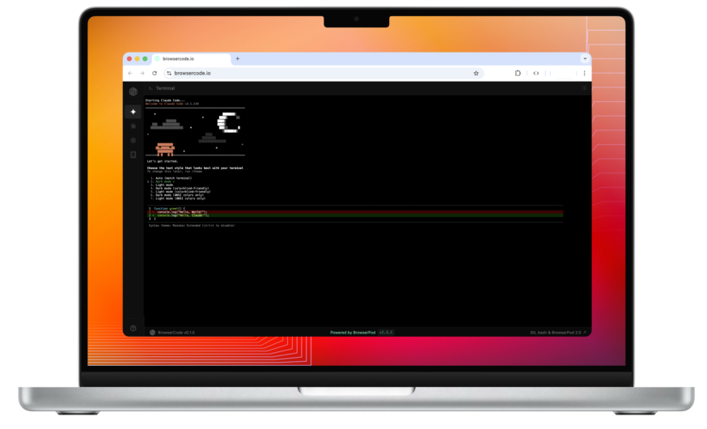

  
  
 

  <h1>Run AI coding CLIs in the browser</h1>

  

 A BrowserPod-based solution to embed AI coding CLIs in web applications.
  

<h2 id="table-of-contents">Table of contents</h2>

- [What is BrowserCode?](#about)
- [Quickstart](#quickstart)
- [Breaking BrowserCode](#breaking-browsercode)
- [Roadmap](#roadmap)

<h2 id="about">What is BrowserCode?</h2>

BrowserCode is a browser runtime for AI coding CLIs. BrowserCode is a working example of [BrowserPod](https://browserpod.io/), it includes:

- Node.js v22 running in the browser via WebAssembly
- A browser-contained, POSIX-like filesystem
- Command line tools: bash, git, npm
- Browser sandbox isolation from the user's operating system
- Restricted outbound networking
- Instant previews over URL via BrowserPod's portal function
- Support for Express.js, Svelte, Next, Nuxt and React (with Wasm overrides)

BrowserCode 0.5.0 is our second beta release. This preview launches with an unmodified version of Claude Code, running completely client-side. Gemini CLI is available as well.

<h2 id="quickstart">Quickstart</h2>

1. Go to [browsercode.io](https://browsercode.io)
2. BrowserCode will boot instantly, opening with a quick modal tutorial to guide you
3. Claude Code will launch instantly
4. Depending on your log-in option, you may be asked to authenticate your account by copying a code from a separate tab

 

<h2 id="breaking-browsercode">Breaking BrowserCode</h2>
This is BrowserCode beta. Don't be kind to it. Stretch it, bend it, find out what breaks. Here are a few walls you might hit:

- At launch, Claude is prompted using a custom skill to help it understand that it is running in a custom environment. However, it may first attempt its default behaviour before referencing the file
- BrowserCode doesn't yet support native binaries, for more information, see the [BrowserPod documentation](https://browserpod.io/docs/guides/native-binaries)
- Networking over TCP isn't available
- For maximum compatbility, please use a Chromium browser. Safari currently isn't supported

<h2 id="roadmap">Roadmap</h2>

| | CLI | Status |
| :---: | --- | --- |
|  | **Gemini CLI** | ✅ Beta open now |
|  | **Claude Code** | ✅ Beta open now |
|  | **Codex** | 🚧 Coming soon |
|  | **OpenCode** | 🚧 Coming soon |

(<a href="#readme-top">back to top</a>)

