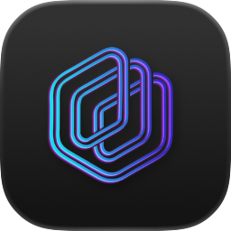
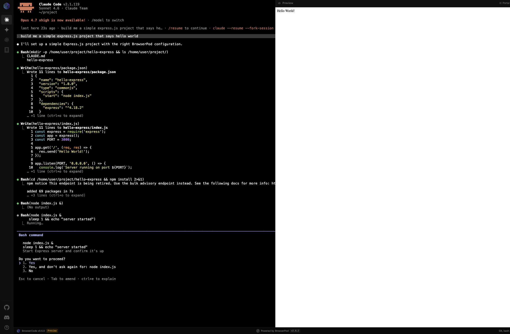

<div align="center">



<br />

# Build web apps that embed AI coding CLIs

BrowserCode is an open source project built on [BrowserPod](https://browserpod.io/), a serverless runtime with a POSIX filesystem, `bash`, `git`, `npm`, and live previews, all running client-side via WebAssembly.

[](https://discord.gg/8ySMrQv6X)
[](https://github.com/leaningtech/browsercode/issues)
[](package.json)
[](LICENSE.txt)
[](https://npm.im/browserpod)

[Try it live](https://browsercode.io) · [Quickstart](#quickstart) · [How it works](#how-it-works) · [Roadmap](#roadmap) · [BrowserPod docs](https://browserpod.io/docs)

</div>

---

<div align="center">



</div>

## What is BrowserCode?

BrowserCode is a runtime for AI coding CLIs. Using [BrowserPod](https://browserpod.io/), the POSIX filesystem, the dev server, and the network proxy all run **inside the user's browser tab** via WebAssembly. It boots instantly.

This repo is the demo: a shell that boots [Claude Code](https://www.anthropic.com/claude-code) and [Gemini CLI](https://github.com/google-gemini/gemini-cli) (with [Codex](https://openai.com/codex) and [OpenCode](https://opencode.ai) on the way), each in its own route, each with a live preview pane fed by BrowserPod's portal function.

## Quickstart

### Use it

Just open **[browsercode.io](https://browsercode.io)**. The default route boots Claude Code in your browser; switch CLIs from the sidebar or by visiting:

| Route | CLI |
| --- | --- |
| [`/claude`](https://browsercode.io/claude) | Claude Code |
| [`/gemini`](https://browsercode.io/gemini) | Gemini CLI |
| [`/codex`](https://browsercode.io/codex) | Codex *(coming soon)* |
| [`/opencode`](https://browsercode.io/opencode) | OpenCode *(coming soon)* |

Depending on your auth method, you may be asked to copy a code from a separate tab. After that, prompt the agent like you would on your laptop — except the filesystem it edits, the `npm install` it runs, and the dev server it spins up are all living in the same tab.

### Run it locally

```bash
git clone https://github.com/leaningtech/browsercode.git
cd browsercode
npm install
```

You'll need a BrowserPod API key (`VITE_API_KEY`) from [browserpod.io](https://browserpod.io/) before `npm run dev` will boot a Pod.

## How it works


The shell does three things:

1. **Boots a Pod per route.** `/[tool]/+page.svelte` calls `bootCLI(tool)` from [src/lib/utils/main.ts](src/lib/utils/main.ts), which loads `@leaningtech/browserpod`, mounts the right disk image (e.g. `claude_20260506.ext2`), and runs the CLI's entrypoint inside the sandbox.
2. **Wires a terminal.** `pod.createDefaultTerminal()` is bound to the `#console` element so the CLI's stdio renders in the page.
3. **Surfaces previews via the portal.** When something inside the Pod starts a server, BrowserPod's `onPortal` callback fires with a public URL. The Portal pane embeds that URL, with copy-link and QR-code affordances.

Per-tool config — disk image, command, args, optional auth-redirect rewrite — lives in [src/lib/config/tools.ts](src/lib/config/tools.ts).

## What's included

|  |  |
|---|---|
| **Node.js, in the browser** | A Node runtime compiled to Wasm with `bash`, `git`, `npm`, and standard coreutils. Files can persist via OPFS / IndexedDB. |
| **Instant previews via portal URLs** | Any port a process opens inside the Pod gets a public preview URL through BrowserPod's portal. |
| **Cross-origin isolated** | `COOP`/`COEP`/`CORP` headers required by BrowserPod, configured in [_headers](_headers) and [vite.config.ts](vite.config.ts). |
| **Frameworks supported** | Express, Next, Nuxt, and React work out of the box (with Wasm overrides — see below). |

## Project layout

```text
browsercode/
├── src/
│   ├── routes/                   # one route per CLI: /claude, /gemini, ...
│   └── lib/
│       ├── components/           # Terminal, Portal, Sidebar, Stepper, UtilityBar
│       ├── config/tools.ts       # CLI registry + per-tool BrowserPod config
│       └── utils/main.ts         # bootCLI() — mounts the Pod and runs the CLI
├── static/
│   ├── project/
│   │   ├── claude/CLAUDE.md      # shipped into the Pod for Claude Code
│   │   └── gemini/GEMINI.md      # shipped into the Pod for Gemini CLI
│   └── readme/                   # README assets
├── _headers                      # COOP/COEP/CORP for cross-origin isolation
└── vite.config.ts                # same headers, mirrored for dev
```

## Breaking BrowserCode

This is BrowserCode's second beta. Don't be kind to it. Stretch it, bend it, find out what breaks. A few walls you might hit:

- **The agent may ignore its primer on the first turn.** The `CLAUDE.md` / `GEMINI.md` shipped into the Pod tells the model it's running on Wasm, but it can default to its usual behavior before consulting the file. Re-prompt or remind it.
- **No native binaries.** See [Wasm overrides](#the-single-most-important-constraint-wasm-overrides) above. If `npm install` blows up, this is almost always why.
- **Networking over TCP isn't available.**
- **Use a Chromium browser for maximum compatibility.** Safari isn't supported.

More edge cases live in the [BrowserPod docs](https://browserpod.io/docs/guides/native-binaries).

## Roadmap

| | CLI | Status |
| :---: | --- | --- |
|  | **Gemini CLI** | ✅ Beta open now |
|  | **Claude Code** | ✅ Beta open now |
|  | **Codex** | 🚧 Coming soon |
|  | **OpenCode** | 🚧 Coming soon |

## Contributing

Issues and PRs are welcome — especially: more CLI integrations, Wasm overrides we've missed, and reproductions for crashes/hangs you find while breaking it.

For platform-level questions (BrowserPod itself, disk images, native-binary support), the right venue is the [BrowserPod issue tracker](https://github.com/leaningtech/browserpod) and the [Discord](https://discord.gg/8ySMrQv6X).

## License

Apache-2.0 — see [LICENSE.txt](LICENSE.txt).

---

<div align="center">

Built by [Leaning Technologies](https://leaningtech.com) on top of [BrowserPod](https://browserpod.io/).

</div>
